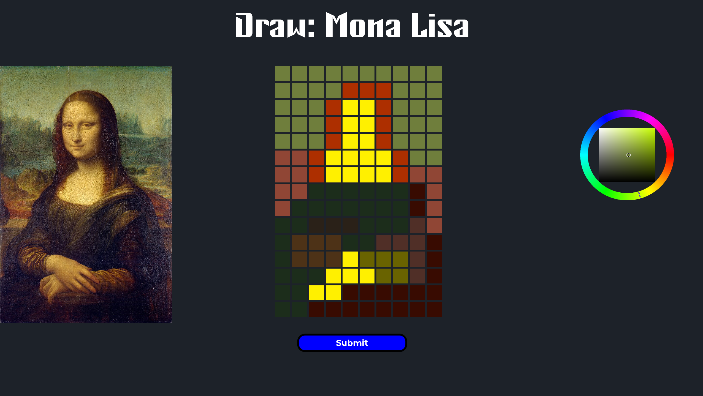
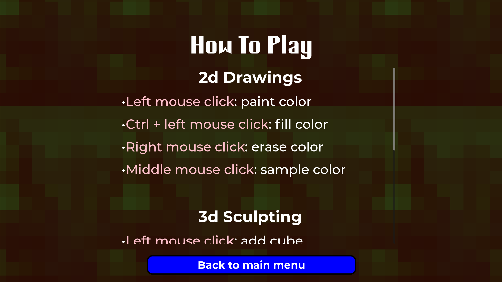
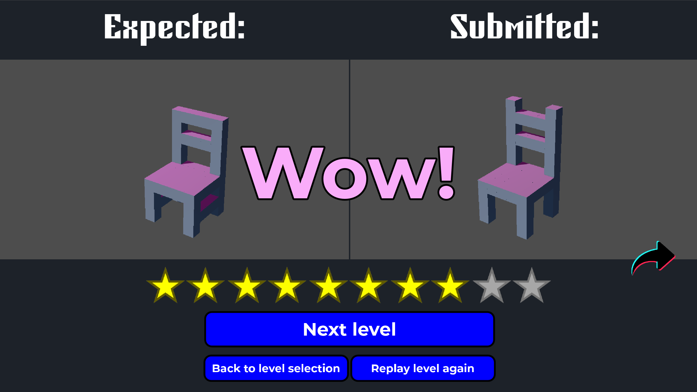
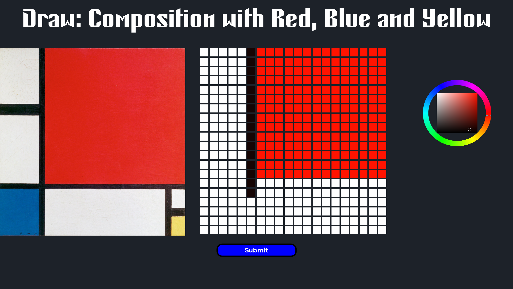
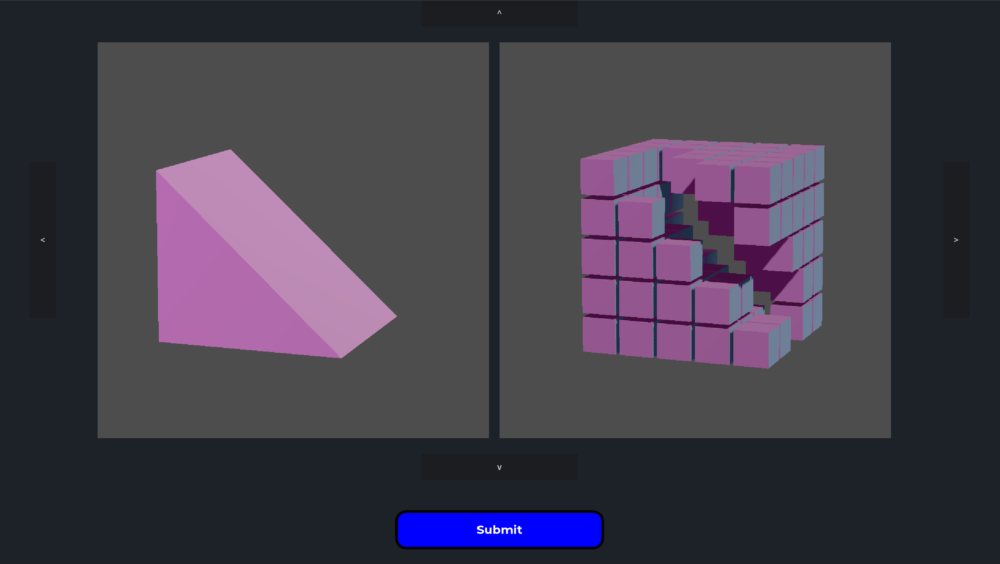

# Scale It Down!

A GMTK Game Jam 2024 submission. The theme was: "Built to Scale". **Play at: https://jynus.itch.io/scale-it-down**

## Screenshots

## Credits

<em>Scale It Down!</em> is a Godot 4.3 engine development for the GMTK Game Jame 2024. Developped in 4 days for the theme "Built to Scale"

All design and programming was made by Jynus.
Sound effects and music by Epidemic Sound.

### Additional credits

* Flags of France, Texas, European Union and Ukraine in Public domain. Usage restrictions may apply in some countries.
* Starry Night, Mona Lisa, Composition II in Red, Blue and Yellow and The Scream are pictures are under public domain
* Chair 3d model: CC-BY-4.0 by [ilyafom1](https://sketchfab.com/3d-models/chair-9e3a202ac8ac4fd58bdd096fd7d6fc62)
* Statue of Liberty model: CC-BY-4.0 by [3Dystopia](https://sketchfab.com/3d-models/statue-of-liberty-04a8e7b1ba9142ba8cebc6108cd5bb97)
* Utah teapot by Martin Newell, public domain.
* Tetris T Shape: CC-BY-4.0 by [Kroko.blend](https://sketchfab.com/3d-models/tetris-blocks-collection-41ed7c3fc0eb4519ae1245f4fb1aecbb)
* Godot logo: CC-BY-4.0 by Andrea Calabró
* Montserrat font: Open font license 1.1 by Julieta Ulanovsky
* Concrete font: Open font license 1.1 by Frank Baranowski
* GitHub, X and Itch.io icons are trademarked by the respective owners and used here under fair use.
